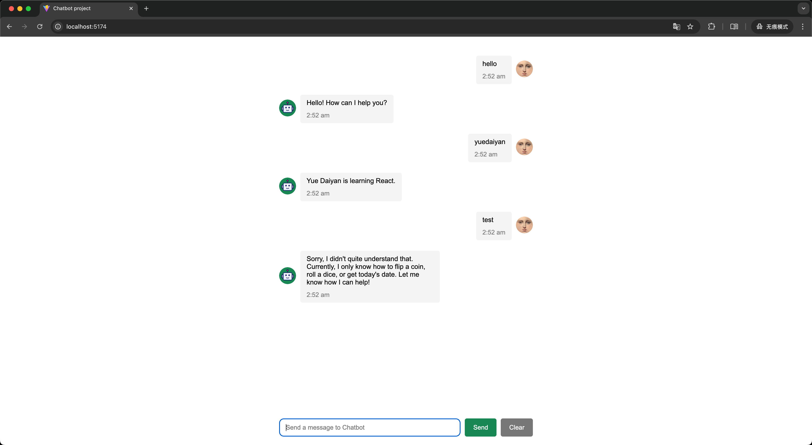
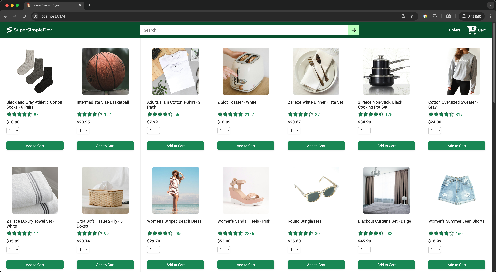
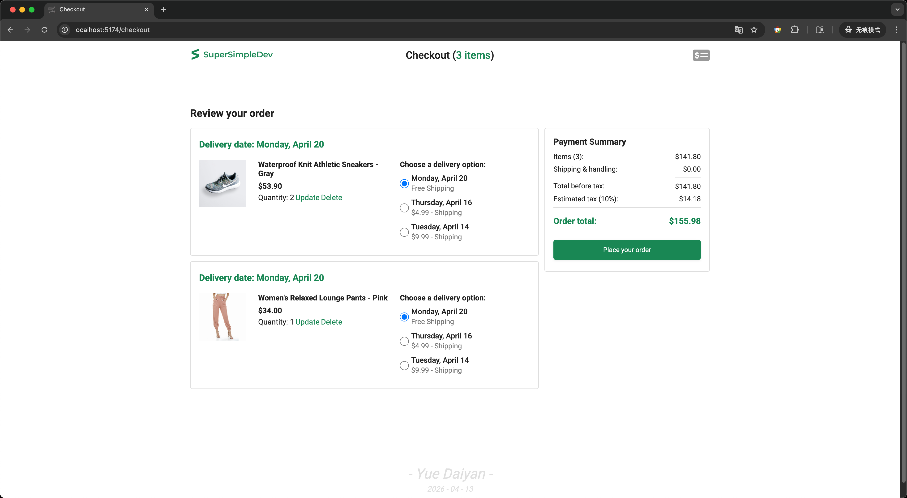
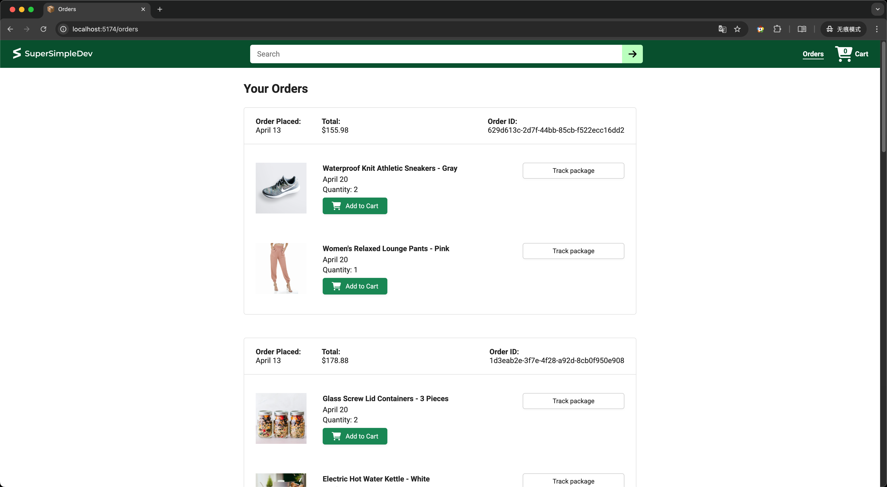
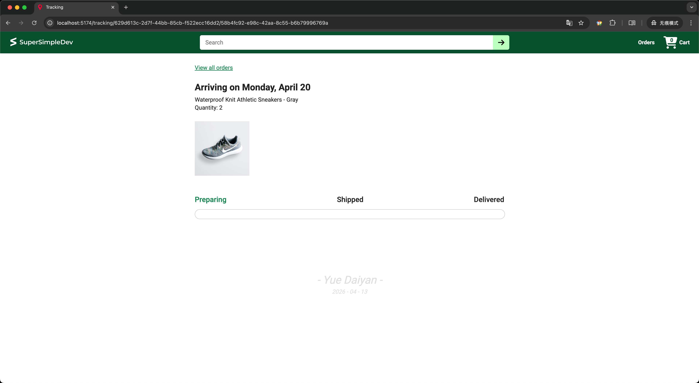

# React Course: E-commerce platform

This repository documents my React learning journey, including exercises and final projects.
The course covers React fundamentals: Vite, components, async, API integration, Vitest testing, TypeScript, and AWS deployment (Elastic Beanstalk).
Final projects: a chatbot and an e-commerce website.

<small>本仓库记录了我学习 React 的过程，包括作业与最终项目。</small>
<small>课程聚焦于React的基本原理，包括Vite、组件、异步、API对接、Vitest测试框架、TypeScript、AWS部署(Elastic Beanstalk)等。</small>
<small>最终项目包括一个聊天机器人，一个电商网站。</small>

## Final Project

### Project 1: Chatbot

- **File Path:** `/react-course/chatbot-project`
- **Link:** `https://yuedaiyan.github.io/chatbot-project/`

<br>
<div align="center">
        <a href="https://yuedaiyan.github.io/chatbot-project/">
            
        </a>
</div>
<br>
<div align="center">

[Chatbot Demonstration](https://yuedaiyan.github.io/chatbot-project/)


</div>

- **Project Launch Method**

```bash
cd /react-course/chatbot-project
npm install
npm run dev
```

<br>

### Project 2: Ecommerce Project
- **File Path:** `/react-course/ecommerce-project` `/react-course/ecommerce-backend`
- **Link (AWS):** http://ecommerce-project-react-env.eba-ydsmpdz5.us-east-2.elasticbeanstalk.com/

<br>
<div align="center">
        <a href="http://ecommerce-project-react-env.eba-ydsmpdz5.us-east-2.elasticbeanstalk.com/">
            
        </a>
</div>
<div align="center">

[Home](http://ecommerce-project-react-env.eba-ydsmpdz5.us-east-2.elasticbeanstalk.com/)

</div>

<br>
<div align="center">
        <a href="http://ecommerce-project-react-env.eba-ydsmpdz5.us-east-2.elasticbeanstalk.com/">
            
        </a>
</div>
<div align="center">

[Checkout](http://ecommerce-project-react-env.eba-ydsmpdz5.us-east-2.elasticbeanstalk.com/)

</div>

<br>
<div align="center">
        <a href="http://ecommerce-project-react-env.eba-ydsmpdz5.us-east-2.elasticbeanstalk.com/">
            
        </a>
</div>
<div align="center">

[Orders](http://ecommerce-project-react-env.eba-ydsmpdz5.us-east-2.elasticbeanstalk.com/)

</div>

<br>
<div align="center">
        <a href="http://ecommerce-project-react-env.eba-ydsmpdz5.us-east-2.elasticbeanstalk.com/">
            
        </a>
</div>
<div align="center">

[Tracking](http://ecommerce-project-react-env.eba-ydsmpdz5.us-east-2.elasticbeanstalk.com/)

</div>

- **Project Launch Method**

```bash
cd react-course/ecommerce-backend
npm install
npm run dev
```

```bash
cd react-course/ecommerce-project
npm install
npm run dev
```
<br>

## Resources & Credits
* **Course Video:** [React Tutorial Full Course - Beginner to Pro (React 19, 2025)](https://www.youtube.com/watch?v=TtPXvEcE11E&t=25063s)
* **Assignments:** [Course Repository](https://github.com/SuperSimpleDev/react-course)

---

_Completed as part of my Front-End development learning journey._
